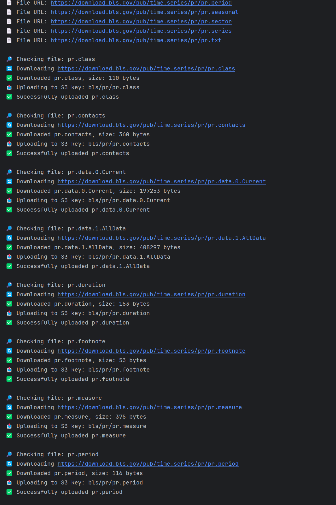
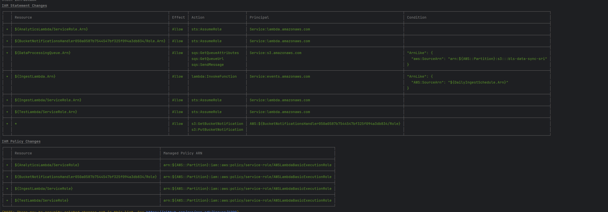
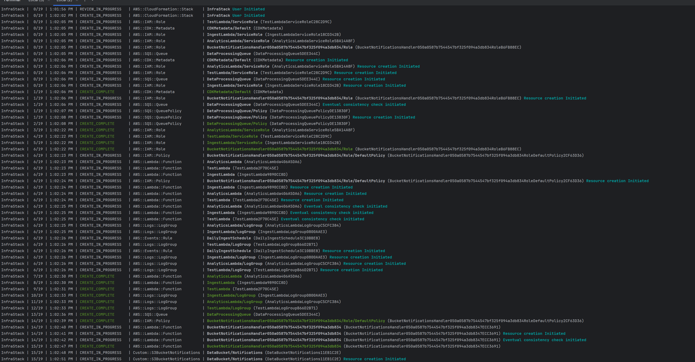

# 📦 **Rearc Data Quest**
# Part 1: BLS Dataset Sync to S3

### 👋 Overview

This project fetches and republishes the U.S. Bureau of Labor Statistics (BLS) **"Productivity and Costs"** dataset from their public website to an Amazon S3 bucket. It ensures the files in S3 are **kept in sync** with the BLS source by:

- Detecting **new**, **deleted**, or **updated** files
- Uploading only what's needed
- Avoiding duplicates
- Preserving the folder structure

### 🚀 Features

- 📥 Scrapes BLS source: `https://download.bls.gov/pub/time.series/pr/`
- 📤 Uploads to S3: `s3://<your-bucket-name>/bls/pr/`
- 🔁 Keeps S3 folder synchronized (additions, updates, deletions)
- 🛡️ Adds a proper `User-Agent` header to comply with BLS access policy

### 🧪 Example Sync Output

```bash
🚀 Starting sync from BLS to S3...

🔍 Found 12 files on BLS site.
📄 Downloading: pr.class, pr.data.0.Current, ...
✅ Uploaded: pr.data.0.Current
🗑️ Deleted: pr.old.version (no longer at source)

✅ Sync complete.
```
### Public S3 Links for Dataset Files

Below are the public URLs for all the files synced to the S3 bucket as part of Part 1:

- [pr.class](https://bls-data-sync-sri.s3.us-east-2.amazonaws.com/bls/pr/pr.class)
- [pr.contacts](https://bls-data-sync-sri.s3.us-east-2.amazonaws.com/bls/pr/pr.contacts)
- [pr.data.0.Current](https://bls-data-sync-sri.s3.us-east-2.amazonaws.com/bls/pr/pr.data.0.Current)
- [pr.data.1.AllData](https://bls-data-sync-sri.s3.us-east-2.amazonaws.com/bls/pr/pr.data.1.AllData)
- [pr.duration](https://bls-data-sync-sri.s3.us-east-2.amazonaws.com/bls/pr/pr.duration)
- [pr.footnote](https://bls-data-sync-sri.s3.us-east-2.amazonaws.com/bls/pr/pr.footnote)
- [pr.measure](https://bls-data-sync-sri.s3.us-east-2.amazonaws.com/bls/pr/pr.measure)
- [pr.period](https://bls-data-sync-sri.s3.us-east-2.amazonaws.com/bls/pr/pr.period)
- [pr.seasonal](https://bls-data-sync-sri.s3.us-east-2.amazonaws.com/bls/pr/pr.seasonal)
- [pr.sector](https://bls-data-sync-sri.s3.us-east-2.amazonaws.com/bls/pr/pr.sector)
- [pr.series](https://bls-data-sync-sri.s3.us-east-2.amazonaws.com/bls/pr/pr.series)
- [pr.txt](https://bls-data-sync-sri.s3.us-east-2.amazonaws.com/bls/pr/pr.txt)


```
### Setup Instructions

#### Prerequisites
- Python 3.7+
- AWS CLI configured with access to your S3 bucket
- Install Python dependencies:
```bash
pip install -r requirements.txt
```

### AWS Setup

#### 1. Create an S3 Bucket
- Go to the [AWS S3 Console](https://s3.console.aws.amazon.com/s3/home)
- Click **Create bucket**
- Enter a unique bucket name, e.g., `bls-data-sync-sri`
- Select a region close to you
- Keep all other default settings or adjust as needed
- Click **Create bucket**

#### 2. Configure Bucket Permissions for Public Access (Optional)
> **Note:** Only do this if you want the files to be publicly accessible via URL.

- In your S3 bucket, go to the **Permissions** tab
- Under **Block public access**, click **Edit**
- Uncheck **Block all public access**
- Confirm the warning and save changes


#### 3. Add a Bucket Policy to Allow Public Read Access on Your Prefix
- Still in the **Permissions** tab, scroll to **Bucket policy**
- Add this policy, replacing `your-bucket-name` with your bucket’s name:

```json
{
    "Version": "2012-10-17",
    "Statement": [
        {
            "Sid": "AllowPublicReadOnPrefix",
            "Effect": "Allow",
            "Principal": "*",
            "Action": "s3:GetObject",
            "Resource": "arn:aws:s3:::your-bucket-name/bls/pr/*"
        }
    ]
}
```
- Save the bucket policy

#### 4. Configure AWS CLI with Your Credentials

Run this command and enter your AWS access credentials:

```bash
aws configure
```
You will be prompted for:

- **AWS Access Key ID**
- **AWS Secret Access Key**
- **Default region** (should match your bucket region)
- **Output format** (default is `json`)


#### 5. Verify Your Bucket and Permissions

List files in your S3 prefix using this command:

```bash
aws s3 ls s3://your-bucket-name/your-prefix/ --recursive
```
### Local Directory Testing

If you don’t have access to the source website or want to test the sync process locally, you can use a local directory as the source.

- Prepare a local folder (e.g., `./local_source`) containing the files you want to sync.
- The sync script will compare files in this local directory with the files in your S3 bucket prefix.
- It will upload new or updated files from the local directory to S3.
- It will delete files from S3 that no longer exist in the local directory.
- This method helps you verify that your sync logic works correctly before running it against a live web source.

Example usage in your `main.py`:

```python
from sync_local import sync_local_to_s3

LOCAL_DIR = './local_source'       # Local source directory
BUCKET_NAME = 'your-bucket-name'  # Your S3 bucket name
S3_PREFIX = 'bls/pr/'              # S3 prefix/folder to sync to

if __name__ == "__main__":
    sync_local_to_s3(LOCAL_DIR, BUCKET_NAME, S3_PREFIX)
```
- This approach ensures your sync logic is robust and safe before applying it to the public dataset.
---
## Part 2 - DataUSA API Sync

### Overview

This module fetches population data from the [DataUSA API](https://datausa.io/api/) and uploads the JSON response to an Amazon S3 bucket.

It is designed to:

- Fetch data via HTTP GET with retries and backoff to handle transient network errors.
- Upload the fetched JSON data to a specified S3 bucket and prefix.
- Log the success or failure of each step.

### Features

- Uses the `requests` library with a retry strategy for reliable API calls.
- Uploads data as JSON to S3 using the `boto3` library.
- Handles and logs errors gracefully without crashing the entire workflow.

### Setup & Usage

#### Prerequisites

- Python 3.7+
- AWS credentials configured locally (via `~/.aws/credentials` or environment variables)
- Required Python packages:
  - `requests`
  - `boto3`

Install dependencies using pip:

```bash
pip install requests boto3
```
#### Configuration

When initializing the `DataUSASync` class, provide:

- `bucket_name`: Your target S3 bucket name.
- `s3_prefix`: Optional prefix/path inside the bucket to save the file.
- `user_agent`: Optional HTTP User-Agent string for the API requests.

---

#### Running the sync

Example usage:

```python
from datausa_sync import DataUSASync

sync = DataUSASync(
    bucket_name='my-s3-bucket',
    s3_prefix='datausa/population',
    user_agent='MyCustomUserAgent/1.0'
)

sync.run()
```
### Error Handling

- If the API fetch fails after retries, the upload step will be skipped.  
- All exceptions are caught and logged with descriptive error messages.  
- Connection errors such as `ConnectionResetError` are handled by retry logic with exponential backoff.  

### Notes

- Avoid calling the API continuously in a tight loop to prevent rate-limiting or blocking by the remote server.  
- Implement exponential backoff or delay between retries to be polite and reduce failures.  
- This script can be scheduled using cron jobs, Airflow, or any other scheduler for periodic data synchronization.  



---
## Part 3: Data Analytics

### Objective
- Load the CSV file from Part 1 (`pr.data.0.Current`) and the JSON file from Part 2 (population data) into dataframes using Pandas.
- Perform data analysis on these dataframes to generate insights and reports as specified.


### Steps and Analysis

#### 1. Data Loading
- Loaded the **time-series CSV data** from S3 into a Pandas dataframe.
- Loaded the **population JSON data** from S3 into another Pandas dataframe.
- Performed **data cleaning** such as trimming whitespace from column names and string values to ensure smooth filtering and joining.

#### 2. Population Statistics (Part 2 Data)
- Filtered the population dataframe for years between **2013 and 2018** (inclusive).
- Calculated:
  - **Mean annual US population** over these years.
  - **Standard deviation** of the population for this period.
- This provides a snapshot of population trends during the selected years.

#### 3. Best Year per Series (Part 1 Data)
- For each unique `series_id` in the time-series data:
  - Grouped data by `series_id` and `year`.
  - Summed the `value` column for all quarters within each year.
  - Identified the year with the **maximum summed value** per `series_id` — the "best year".
- Generated a report with columns:
  - `series_id`
  - `best year`
  - `summed value` for that year

Example:

| series_id   | year | value |
|-------------|------|-------|
| PRS30006011 | 1996 | 7     |
| PRS30006012 | 2000 | 8     |

#### 4. Combined Report (Joining Part 1 & Part 2)
- Filtered the Part 1 dataframe for `series_id = 'PRS30006032'` and `period = 'Q01'`.
- Joined this subset with population data from Part 2 on the `year` column.
- Included population data for matching years where available.
- The final report includes columns:

| series_id   | year | period | value | Population  |
|-------------|------|--------|-------|-------------|
| PRS30006032 | 2018 | Q01    | 1.9   | 327167439   |


### Notes
- **Data Cleaning:** Trimming whitespace from CSV columns and string fields was essential due to formatting issues in the source CSV file.
- **Missing Data:** Some years might not have corresponding population data, leading to `NaN` values in the combined report.
- **Analysis Focus:** These reports enable observing economic indicator peaks per series and how they relate to US population changes over time.


### Deliverables
- Submit this analysis as a Jupyter notebook (`.ipynb`) including:
  - Data loading code
  - Data cleaning steps
  - Queries/transformations for the reports
  - Outputs of the reports as shown above

*This completes the data analytics portion of the project using publicly available economic and population datasets.*

#### Why Pandas + boto3 instead of PySpark for Part 3?

- **Data Size Consideration:**  
  The datasets used in Part 1 (CSV) and Part 2 (JSON) are relatively small and fit comfortably in memory. Pandas is ideal for such small to medium data sizes and offers simplicity and quick prototyping.

- **Environment Constraints:**  
  Setting up PySpark requires a Spark environment (local or cluster) and can introduce complexity, especially when working in limited environments or during rapid development.

- **Deployment Simplicity:**  
  Using boto3 with Pandas allows easy integration with AWS S3 for data access and manipulation without the overhead of managing Spark clusters or configurations.

- **Error Handling and Debugging:**  
  Pandas is easier to debug interactively in Jupyter notebooks, making it well suited for iterative data exploration and analytics tasks.

- **Project Scope:**  
  This part mainly focuses on **data analytics and generating reports** rather than large-scale distributed processing. PySpark’s distributed nature is more beneficial for massive datasets, which is not the case here.

- **Future Scaling:**  
  If datasets grow substantially in the future or if the workload shifts to a big data pipeline, migrating to PySpark or Spark-based analytics would be appropriate.

**In summary:**  
For this part3, **Pandas with boto3 is the most straightforward and efficient tool** to load data from S3, clean it, perform transformations, and generate reports, especially within a Jupyter notebook environment.

----

## Project Structure

The project is organized into the following directory structure:

```
rearc-data-quest/
├── assets/                  # Images used in the README
├── infra/                   # AWS CDK infrastructure code (Part 4)
│   ├── infra/               # Main CDK stack definition
│   ├── tests/               # CDK stack tests
│   └── app.py               # CDK application entry point
├── lambda_handlers/         # AWS Lambda function code
│   ├── analytics_lambda/    # Data analytics Lambda (Part 3)
│   │   ├── analytics_handler.py  # Main handler for analytics
│   │   └── requirements.txt      # Dependencies for analytics Lambda
│   └── ingest_lambda/       # Data ingestion Lambda (Parts 1 & 2)
│       ├── part1/           # BLS data sync code (Part 1)
│       │   └── bls_s3_sync.py    # BLS sync implementation
│       ├── part2/           # DataUSA API sync code (Part 2)
│       │   └── datausa_sync.py   # DataUSA sync implementation
│       ├── ingest_handler.py     # Main handler for ingestion
│       └── requirements.txt      # Dependencies for ingestion Lambda
├── lambda_layers/           # Lambda layers for dependencies
├── part3/                   # Data analytics code (Part 3)
├── python/                  # Python dependencies
├── main.py                  # Main application entry point
└── requirements.txt         # Project dependencies
```

### Key Components

- **main.py**: The main entry point for local execution of the data sync process
- **lambda_handlers/ingest_lambda/part1/bls_s3_sync.py**: Implements BLS data synchronization (Part 1)
- **lambda_handlers/ingest_lambda/part2/datausa_sync.py**: Implements DataUSA API data fetching (Part 2)
- **lambda_handlers/analytics_lambda/analytics_handler.py**: Implements data analytics (Part 3)
- **infra/infra/infra_stack.py**: Defines the AWS CDK infrastructure stack (Part 4)

### How Components Interact

1. **Local Execution**: `main.py` calls the BLS sync and DataUSA sync implementations directly
2. **AWS Deployment**: 
   - The CDK stack in `infra_stack.py` deploys the Lambda functions and other AWS resources
   - The ingest Lambda (`ingest_handler.py`) is triggered daily by EventBridge
   - When new data is uploaded to S3, an event notification triggers the analytics Lambda via SQS

## Part 4: Infrastructure as Code & Data Pipeline with AWS CDK

### Overview

In this part, we implemented a fully automated data pipeline using AWS Cloud Development Kit (CDK) to orchestrate the earlier data processing and analytics steps. The goal was to automate data ingestion, processing, and reporting on AWS infrastructure, ensuring reliability, scalability, and ease of deployment.

### 🚀 Deployment Instructions

#### • Prerequisites:

Make sure the following tools and dependencies are installed before deploying:

```bash
# Install Python dependencies
pip install -r requirements.txt

# Install AWS CDK globally
npm install -g aws-cdk

# Set up necessary AWS resources for CDK
cdk bootstrap

# Deploy the stack
cdk deploy
```

## ✅ 5. Architecture Diagram

```plaintext
(EventBridge - Daily Trigger)
           |
           v
     +--------------+
     | IngestLambda |
     +--------------+
           |
           v
     +----------------------+
     |   S3 Bucket          |
     |  (bls/pr/, datausa/) |
     +----------------------+
           |
           v
 (S3 Event Notification on upload)
           |
           v
     +------>------------------+
     |         SQS Queue       |
     +-------------------------+
                      |
                      v
             +------------------+
             | AnalyticsLambda  |
             +------------------+
```

### What We Have Done

#### 1. Created a Scheduled Lambda Function for Data Ingestion and Sync (Parts 1 & 2)

- Combined the logic from Part 1 and Part 2 (data ingestion and API data fetching) into a single Lambda function.
- Scheduled this Lambda to run **daily** using AWS EventBridge (CloudWatch Events rule), ensuring data is regularly updated without manual intervention.
- **Why:** Automating ingestion and syncing reduces manual effort and guarantees up-to-date data availability in the S3 bucket.


#### 2. Set Up an S3 Bucket and S3 Event Notifications

- Used an existing S3 bucket (`bls-data-sync-sri`) to store the ingested JSON files.
- Configured **S3 event notifications** to trigger whenever new JSON files are uploaded under a specific prefix (`datausa/`).
- These notifications send messages to an SQS queue.
- **Why:** Event-driven architecture helps decouple services and trigger downstream processes automatically on data arrival.


#### 3. Created an SQS Queue to Buffer Incoming Events

- Created an SQS queue to receive notifications of new data files from S3.
- The queue acts as a reliable buffer ensuring no data events are lost even if downstream processes are busy or temporarily unavailable.
- **Why:** Using SQS improves the reliability and scalability of the pipeline by handling spikes and failures gracefully.


#### 4. Created a Lambda Function to Process SQS Messages and Output Reports (Part 3)

- Developed a second Lambda function triggered by messages in the SQS queue.
- This Lambda executes the reporting logic from Part 3 — running queries on the ingested data and logging results.
- **Why:** Automating report generation in response to new data provides timely insights and closes the processing loop.


#### 5. Infrastructure as Code with AWS CDK

- Defined all AWS resources (Lambda functions, S3 bucket notifications, SQS queue, event triggers) in Python CDK code.
- **Benefits:**
  - **Repeatable deployment:** Easily redeploy the entire infrastructure.
  - **Version control:** Infrastructure code can be tracked, reviewed, and improved.
  - **Consistency:** Eliminates manual setup errors.
  - **Scalability:** Easily extend the pipeline in future with more components.




### How It Works Together (End-to-End Flow)

1. **Daily Scheduled Lambda** runs to ingest and sync data (Parts 1 & 2).
2. Ingested data is written as JSON files into the S3 bucket.
3. S3 event triggers send a message to the SQS queue upon new file arrival.
4. SQS message triggers the **Analytics Lambda** to process the new data and log reports (Part 3).
5. The pipeline runs fully automatically every day without manual intervention.




### Summary

- Combined data ingestion and syncing logic into a daily scheduled Lambda.
- Automated notification from S3 to SQS for new data files.
- Processed data asynchronously from the queue to generate reports.
- Used AWS CDK to define, deploy, and manage the entire pipeline as code.
- This architecture provides a robust, scalable, and maintainable data pipeline for automated data processing and analytics.
